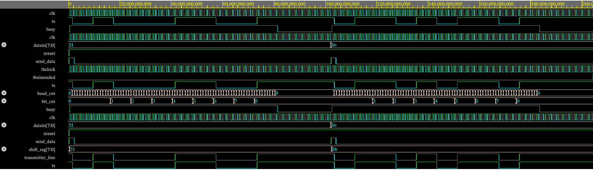

### important parameters:
- baud rate: 65000 (period is roughly 1538 ns)
- internal oscillator frequency: 2.08 MHz
  - divided by 4, components run on 520 kHz, period is roughly 192 ns
- fifo buffer width: 8 bits
- fifo buffer depth: 8 items

### testbenches:
- [rx testbench updated](https://www.edaplayground.com/x/wAuf) 
- [tx testbench](https://www.edaplayground.com/x/bjRU)

